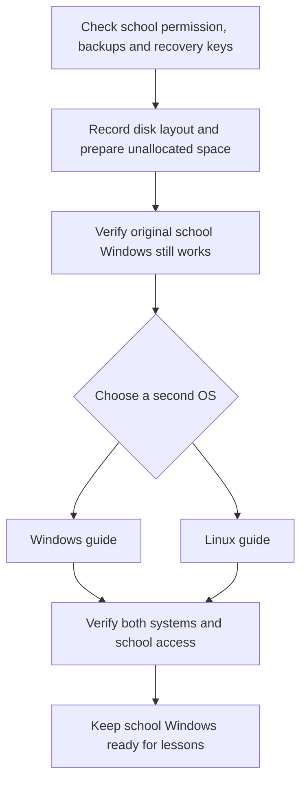

# Singapore MOE Windows Dual-Boot Guide

A community guide for Singapore students who use an MOE DMA-managed Windows laptop as their Personal Learning Device (PLD)—often their only computer—and want room for programming, installing development tools, and personal projects at responsible, agreed times.

The aim is to keep the **original school-managed Windows installation, files, recovery partitions, and school access**, while adding a second Windows or Linux environment where the school permits it. Dual boot means choosing an operating system when the laptop starts; only one runs at a time.

> [!IMPORTANT]
> This is an independent OSS project, not an MOE or school instruction or endorsement. Preserving DMA in one installation does not make a second installation school-approved. Check your school's Acceptable Use Policy (AUP), ask its ICT team whether dual boot is allowed, and agree personal-use times with your parent/guardian. Continue using the managed installation for school.

> [!WARNING]
> Partitioning and boot changes can cause data loss, BitLocker recovery prompts, or a laptop that will not start. Preservation is the design goal, not a guarantee. **Do not start without verified backups, access to the correct recovery key, and a school recovery plan.** Never erase the disk or delete the original Windows, EFI, MSR, or recovery partitions.

## Start here

Prefer to see the screens first? Open the [six-picture walkthrough](docs/visual-walkthrough.md) for what to look for, what each field means, and when to stop.

The sequence below provides the same navigation without the diagram.

1. Read [before you begin](docs/before-you-begin.md), including school permission, backups, encryption, and supported hardware.
2. [Prepare space and installation media](docs/preparation.md). Reboot and check the original Windows before proceeding.
3. Choose **one** second OS: [Windows 11 / Pro](docs/windows.md) or [Linux / Ubuntu](docs/linux.md).
4. Complete [verification and everyday use](docs/everyday-use.md) before relying on the laptop for school.
5. Save [troubleshooting](docs/troubleshooting.md) and [recovery](docs/recovery.md) somewhere accessible without this laptop.

| You want to… | Read this |
| --- | --- |
| Use personal apps after school | Ask about your school's current parent DMA options first; see [scope and alternatives](docs/before-you-begin.md) |
| Get Windows 11 Professional | [Official media, edition selection, and licensing](docs/windows.md) |
| Set up DMA using a MIMS account | [School-directed Windows enrolment](docs/school-enrolment.md) |
| Learn Linux or programming | [Linux installation and compatibility checks](docs/linux.md) |
| Return to school Windows or remove the second OS | [Recovery and rollback](docs/recovery.md) |
| Fix or improve this guide | [Contributing](CONTRIBUTING.md) and [issue templates](https://github.com/liuhc1017/DMA-Guide/issues/new/choose) |

## What this guide covers

The documented path is for **Intel/AMD x64 laptops with UEFI, a GPT basic disk, and a working Windows installation**. It keeps Secure Boot and TPM enabled. ARM/Snapdragon, Windows SE, Chromebooks, iPads, dynamic disks, Storage Spaces, unusual multi-disk layouts, and locked firmware need device-specific school support; do not apply these steps blindly.

A second partition shares the physical disk and usually the EFI boot partition with Windows. It is not a backup or complete security boundary. A disk failure or whole-device reimage can affect both operating systems. DMA policies, enrolment, drivers, and support arrangements differ between schools and device models.

This project documents responsible personal computing while retaining the school environment. It does not provide DMA removal, administrator-password circumvention, firmware-lock workarounds, or instructions to interfere with school management.

## Project status

Documentation and source review: **16 September 2026**. Existing screenshots were captured on **13 February 2026** and are illustrative. These instructions have not been validated end to end on a school-managed PLD; no device model is certified by this project. See [sources and verification limits](docs/sources.md) and the [screenshot catalogue](assets/screenshots/README.md).

Contributions are welcome, especially reproducible corrections, current official school guidance, and privacy-safe screenshots. The project is [MIT licensed](LICENSE); third-party products and UI remain the property of their respective owners.
