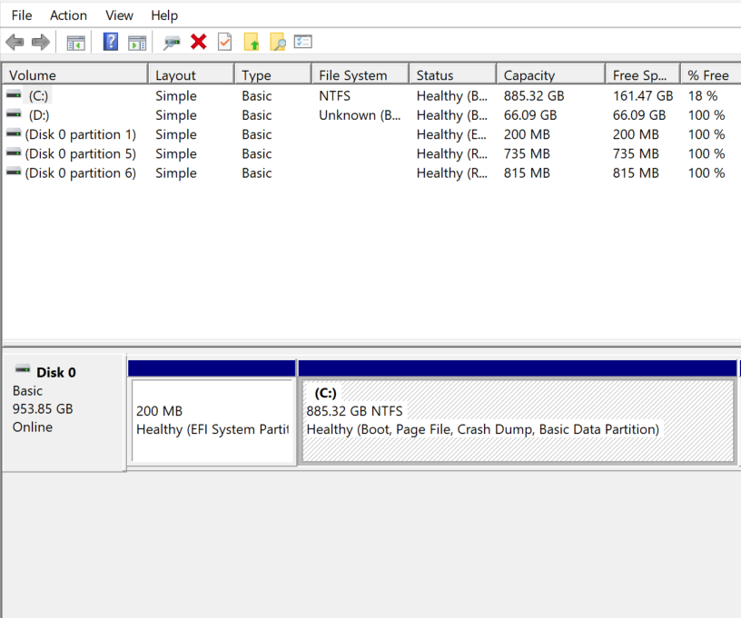
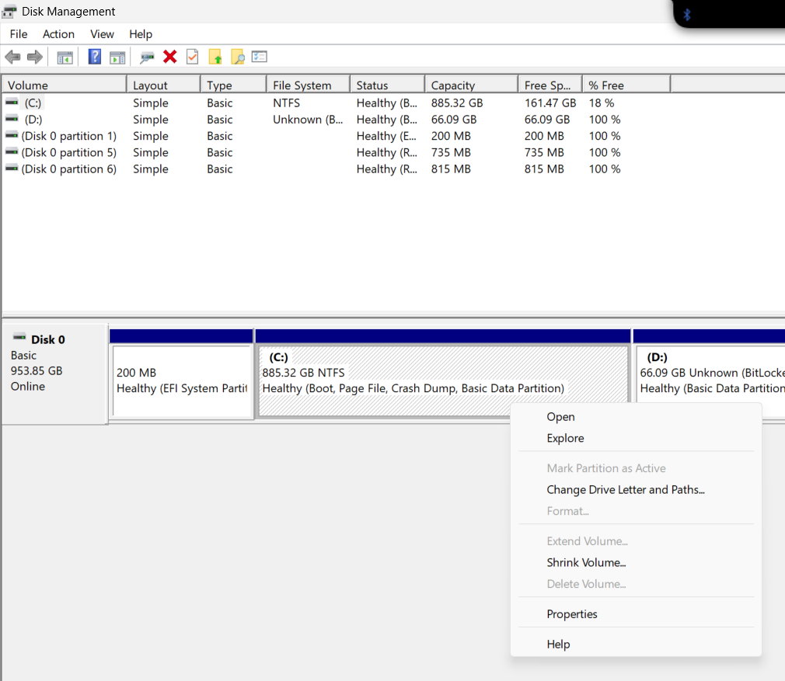
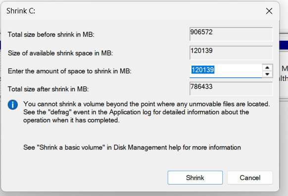

# Prepare space and installation media

[Guide home](../README.md) · Prerequisite: [Before you begin](before-you-begin.md)

## 1. Plan the space

Use these as planning examples, not installer requirements: roughly **100–150 GB for a second Windows environment** or **60–100 GB for a Linux development environment**, with more for games, containers, datasets, and virtual machines. Keep ample free space in school Windows for updates and schoolwork. On a small SSD, there may be no sensible split.

Shrink only the identified school Windows OS volume using Windows Disk Management. Keep the resulting space **unallocated** for the installer. Do not shrink, move, delete, or format EFI, MSR, OEM, or recovery partitions.

Conceptual layout only; real ordering and sizes vary:

```text
Before: [EFI] [MSR] [school Windows + free space] [recovery/OEM]
After:  [EFI] [MSR] [school Windows] [unallocated] [recovery/OEM]
Later:  the second OS occupies the planned unallocated space
```

The EFI System Partition contains boot files; the MSR is Microsoft's reserved partition. Installers may add boot files to the existing EFI partition. Keeping its contents is essential even though it has no ordinary drive letter.

## 2. Check encryption before changing the disk

> [!WARNING]
> A Secure Boot or boot-path change can lock the **original DMA-managed Windows partition** behind a BitLocker recovery prompt. This can happen even when installing only into unallocated space. Obtain the correct recovery key first.

Have the recovery key accessible before the first disk or boot change. Boot changes can trigger BitLocker recovery. Let ICT decide whether temporary suspension is needed and how protection will be resumed. **Suspending BitLocker is not decrypting the drive** and does not resolve an installer's requirement for decryption. Do not clear the TPM. Start with Secure Boot enabled; if the media or drivers need a change, follow the [Secure Boot and BitLocker checks](secure-boot.md) before touching firmware settings.

If Linux installation requires decrypting school Windows, stop and consult ICT; see the [Linux path](linux.md). Do not turn off school-managed encryption merely to make an installer proceed.

## 3. Shrink from school Windows

1. Finish pending updates, restart, and connect AC power.
2. Press **Win+X → Disk Management**. Compare the complete layout with your private record.
3. Right-click the identified Windows OS volume (usually `C:` while running school Windows) → **Shrink Volume**.
4. Enter the planned shrink amount in MB. For example, `102400` MB is approximately 100 GiB. This is the amount removed from the volume, not its final size. Do not accept the maximum automatically.
5. Recheck how much space school Windows will retain, then select **Shrink**. Wait for completion.
6. Confirm that only the intended volume became smaller and the expected unallocated space appeared. Save the updated map privately.
7. **Restart into school Windows and check files, DMA, and school access before installing anything.** If something is wrong, use [recovery](recovery.md).


*Historical example: the view is cropped and is not a complete partition inventory. Your disk number, capacity, and partitions will differ.*


*Choose Shrink Volume only on the volume you have identified. The existing D: volume in this screenshot is not an installation target.*


*The example's 120139 MB value is not a recommendation. Choose your own amount from your capacity plan.*

If shrink space is too small, Windows may be limited by unmovable files. Do not remove restore points, disable school protections, or use an offline partition mover to force it. Reconsider the space plan with ICT. See [Microsoft's shrink documentation](https://learn.microsoft.com/en-us/windows-server/storage/disk-management/shrink-a-basic-volume).

## 4. Create the installer USB

Use a separate blank USB, preferably 16 GB or larger; Microsoft's media tool specifies at least 8 GB. **Writing an installer erases the selected USB.** Confirm its model and capacity, and disconnect backup drives. Download only official images and verify published checksums where provided.

For Windows, use [Microsoft's media creation instructions](https://support.microsoft.com/windows/create-installation-media-for-windows-99a58364-8c02-206f-aa6f-40c3b507420d), or the official ISO with [Rufus](https://rufus.ie/en/). For Linux, follow the distribution's USB instructions linked from the [Ubuntu documentation](https://ubuntu.com/desktop/docs/en/latest/).

The [archived Rufus screenshot](../assets/screenshots/rufus-download.png) shows a historical release; choose the current release from the official site.

If using Rufus on the supported x64 path:

1. Download its Windows x64 executable from the official site; it runs without a separate installation process.
2. Select the correct USB under **Device**, then select the official ISO.
3. For Windows media, choose **Standard Windows installation**, **GPT**, and **UEFI (non CSM)**. For Linux media, follow the distribution's image-writing guidance if Rufus offers ISO/DD choices; do not force Windows-specific settings onto it.
4. Leave the appropriate file-system default. Do not enable Windows hardware-requirement or account-requirement removal options.
5. Recheck the USB target, acknowledge its erasure, and wait for **READY** before safely ejecting it.

Use the manufacturer's **one-time UEFI boot menu** to start the USB; the key varies by model. Do not change to Legacy/CSM, change the storage controller mode, or remove a firmware password. A blocked USB boot requires ICT assistance.

Next: [Windows](windows.md) or [Linux](linux.md).
