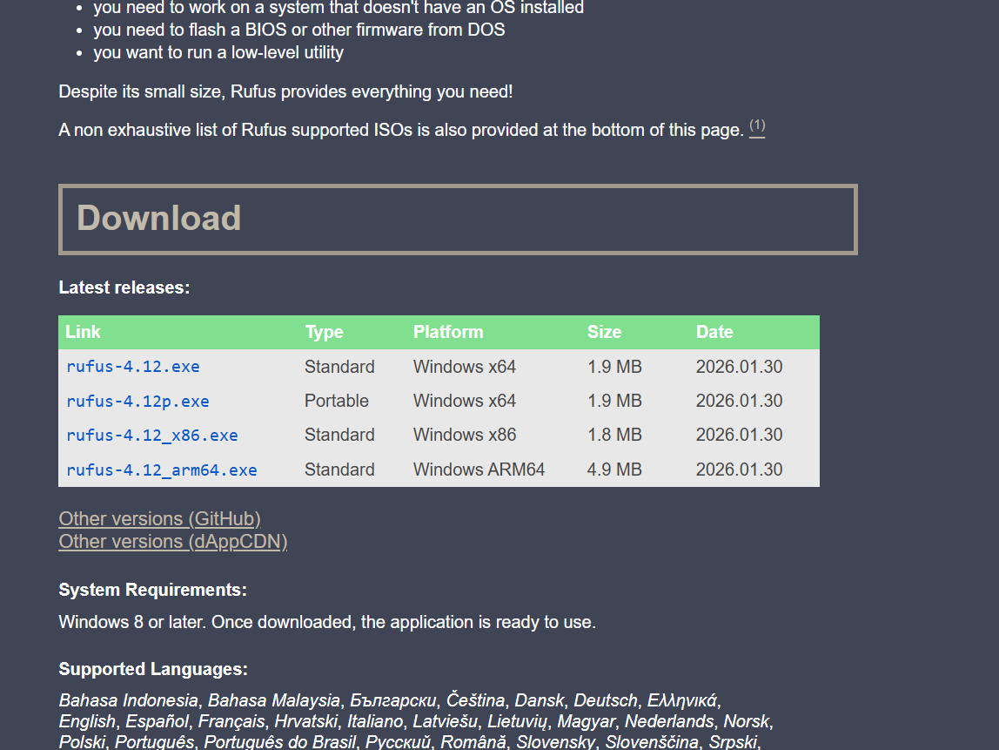

# Visual walkthrough: recognise the screens before you start

[Guide home](../README.md) · [Preparation](preparation.md) · [Windows](windows.md) · [Linux](linux.md)

Use this page beside the instructions, not as a stand-alone installation recipe. All six images are genuine inherited repository screenshots dated **13 February 2026**. They show examples, not your laptop's layout, and do not establish that a complete installation succeeded. Click an image to inspect it at full size.

## 1. Find the official Windows ISO section

**Look for:** “Download Windows 11 Disk Image (ISO) for x64 devices” on [Microsoft's download page](https://www.microsoft.com/en-us/software-download/windows11). The ISO and media creation routes prepare installation media; Installation Assistant works on the currently running Windows.

**Check before continuing:** your device is Intel/AMD x64. The Arm64 link is for a different architecture. Follow [edition and licensing guidance](windows.md) before creating the installer.

## 2. Select the multi-edition image

**Look for:** the x64 multi-edition selection, then choose the requested language and download. The page may have changed since capture.

**Check before continuing:** downloading a multi-edition ISO does not activate Windows or enrol the device with the school. Match the edition and licence to the installation you intend to create.

## 3. Get the USB-writing tool from its publisher

**Look for:** the executable matching the Windows computer that will write the USB. On the documented x64 path, choose the current Windows x64 release from [Rufus](https://rufus.ie/en/). The screenshot's version and release date are historical, not a version requirement.

**Check before continuing:** the next screen that matters is Rufus's **Device** field. Verify the target USB by model/capacity, and disconnect backup media. This repository does not yet have a screenshot of that selection; use the [written USB steps](preparation.md#4-create-the-installer-usb). Writing the image erases the USB you select.

## 4. Read the disk map

| What the example shows | What it means for your decision |
| --- | --- |
| C: is 885.32 GB in this example | Identify your running school Windows by its actual layout; do not copy this size. |
| A 200 MB EFI System Partition | Preserve it. Small partitions can contain essential boot files. |
| Recovery partitions in the upper list | Preserve all original recovery/OEM partitions, even if they do not appear in the cropped lower map. |
| A D: volume | An existing volume is not the unallocated space needed for a new OS. “Unknown” does not mean empty. |
| The lower map extends beyond the image | Capture your whole map privately before proceeding. This screenshot is incomplete. |

**Check before continuing:** your plan changes only the identified Windows OS volume and leaves room for its files and updates. Record encryption status and key access first.

## 5. Open Shrink Volume on the correct volume

**Look for:** **Shrink Volume** on the volume containing the running school Windows, after comparing it with your record.

**Check before continuing:** the example already contains an encrypted/unknown D: volume. It is not spare space to overwrite. Do not select Delete Volume, Format, or an EFI/recovery partition.

## 6. Enter the amount to remove, not the final size

| Dialog field | Read it as… |
| --- | --- |
| Total size before shrink in MB | The current size of the selected volume. |
| Size of available shrink space in MB | The maximum Windows currently offers, not a recommended amount. |
| Enter the amount of space to shrink in MB | The space you want to release for the second OS. |
| Total size after shrink in MB | What remains for school Windows; check it against your plan. |

**Do not copy `120139` from this screenshot.** For scale, `102400` MB is about 100 GiB. The right amount depends on your disk, school files, update headroom, and the second OS.

## The checkpoint these screenshots do not show

After shrinking, Disk Management should show the planned **unallocated space** and all original partitions. Save that map, then restart into school Windows and verify it before installing anything.

There are currently no verified screenshots here of Windows target selection, Ubuntu's final write summary, MIMS provisioning, or Company Portal on an enrolled PLD. Follow the written [Windows](windows.md), [Linux](linux.md), and [school-enrolment](school-enrolment.md) instructions; **stop if the real screen cannot be matched confidently to your plan**. We welcome redacted captures through the [screenshot contribution process](../assets/screenshots/README.md).
