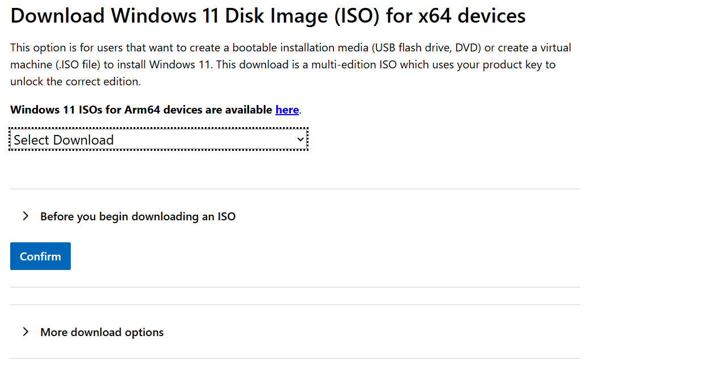
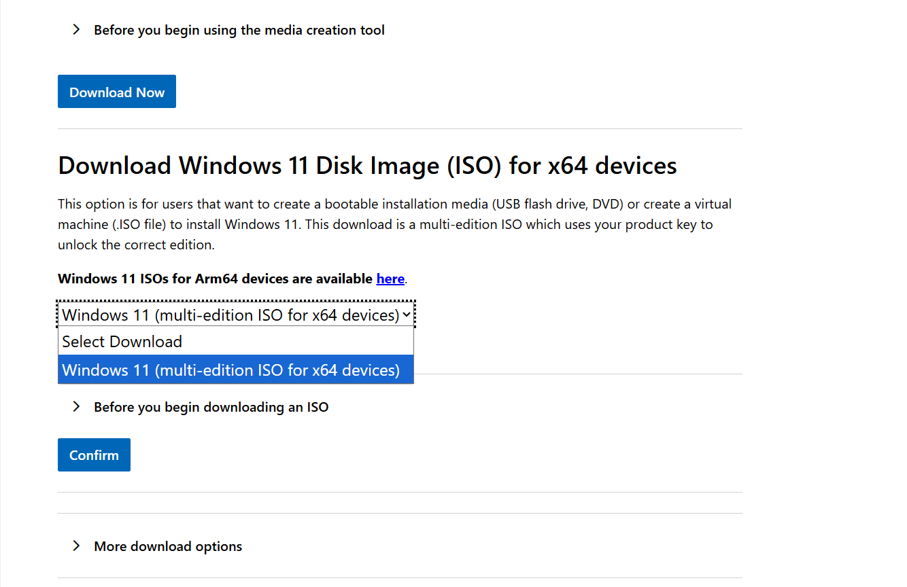

# Add a second Windows 11 installation

[Guide home](../README.md) · Prerequisite: [Preparation](preparation.md)

## Get Windows 11 Professional legitimately

Windows 11 **Pro** is the edition commonly called “Professional”. Download official installation media from [Microsoft](https://www.microsoft.com/en-us/software-download/windows11). The x64 multi-edition ISO can install Pro; the downloaded ISO itself does not grant a licence. Use the media creation tool or ISO route, not Installation Assistant, which upgrades the currently running installation.

*February 2026 example: locate the ISO section on the current official page.*

*This guide covers Intel/AMD x64 hardware. The separate Arm64 download is not interchangeable.*

Obtain a genuine Pro licence from Microsoft/an authorised seller or ask ICT whether your school provides an entitlement for this particular installation. Do not assume the original OEM licence covers an additional installed copy, or that activation proves entitlement. Check the terms of the licence you are actually using. MIMS access and Microsoft 365/Office access do not establish a Windows Pro licence.

When Setup offers an edition list, choose **Windows 11 Pro** if it matches your licence and school instructions. A firmware key may select another edition automatically. If so, stop to confirm the supported Pro installation/upgrade route with ICT or Microsoft; an edition-selection file does not create a licence. This guide does not require editing `ei.cfg` or using generic activation keys. See [Microsoft activation guidance](https://support.microsoft.com/en-gb/windows/activate-windows-c39005d4-95ee-b91e-b399-2820fda32227).

## Install only into the new space

1. Disconnect backup and nonessential external disks. Boot the installer USB using the one-time **UEFI** boot menu.
2. Choose language and keyboard settings. Follow the new-installation path; on installers offering **Custom: Install Windows only**, choose it. UI wording varies by release.
3. At the disk selection screen, identify the internal SSD using the recorded capacity and partition layout. Select **only the unallocated space created in preparation**. Do not select the original Windows volume or any existing “Primary”, EFI/System, MSR/Reserved, Recovery, or OEM partition.
4. **Stop before confirming:** the unallocated capacity must match the plan, all original partitions must remain, and no instruction should require deleting them. A general clean-install tutorial may tell you to delete every partition; that is incompatible with this guide. If the intended space is missing or ambiguous, cancel.
5. Allow Setup to create what it needs in the selected space. It may also update shared EFI boot files. If it cannot proceed without changing/deleting existing partitions, stop for ICT support.
6. Keep AC power connected. After Setup's first restart, let it continue from the internal drive instead of starting the USB installer again. Remove the USB when appropriate.
7. Complete the supported Windows setup flow. If school branding or a mandatory organisational setup appears, follow school instructions or contact ICT; do not try to remove the device's registration. For an approved personal installation, use the agreed personal-account setup. For a school-enrolled installation, follow [MIMS and DMA enrolment](school-enrolment.md).
8. Install Windows updates and exact-model OEM drivers from official sources. Check activation. If network/storage drivers are missing, use the manufacturer's package or ask ICT; do not change RAID/RST/VMD settings as a shortcut.

Two Windows installations may both display “Windows 11” and each may call its own system volume `C:`. Identify them by actually booting and checking their files and accounts, then record the mapping. Never rename or delete an entry by guessing.

**Before installing personal apps, boot the original Windows and complete the [verification checklist](everyday-use.md).**
